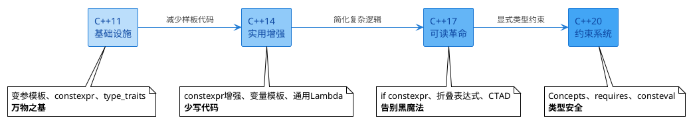
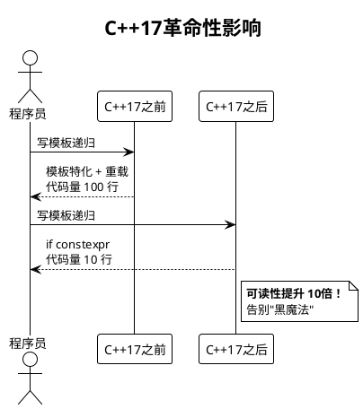
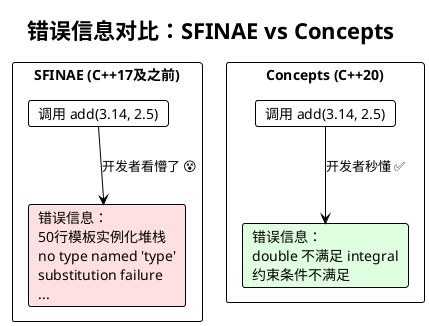

# C++模板元编程演变史 (C++11 → C++20)

> 从基础设施建立 → 实用性增强 → 可读性革命 → 类型安全约束

## 演变路径图



---

## C++11 - 模板元编程现代化基础 ⚡

**主题：万物之基 - 奠定现代模板元编程基础设施**

### TOP 3 关键特性

#### 1. 变参模板 (Variadic Templates)
**核心价值**：可接受任意数量参数，现代模板元编程的基石

```cpp
// C++11之前：需要为每个参数数量写重载
template<typename T1>
void print(T1 arg1) { /*...*/ }

template<typename T1, typename T2>
void print(T1 arg1, T2 arg2) { /*...*/ }

// C++11：一个模板搞定所有
template<typename... Args>
void print(Args... args) {
    // 处理任意数量参数
}
```

#### 2. `constexpr` 函数
**核心价值**：开启编译期计算新范式，函数也能在编译期执行

```cpp
// 编译期计算阶乘
constexpr int factorial(int n) {
    return n <= 1 ? 1 : n * factorial(n - 1);
}

// 结果在编译期计算完成
constexpr int result = factorial(5); // 120，编译期常量
```

#### 3. 类型萃取 `<type_traits>`
**核心价值**：标准库支持类型查询和变换，实用性最强

```cpp
#include <type_traits>

// 类型查询
static_assert(std::is_integral<int>::value, "int是整数类型");
static_assert(!std::is_pointer<int>::value, "int不是指针");

// 类型变换
std::remove_const<const int>::type x = 10;  // int x = 10;
std::add_pointer<int>::type ptr;            // int* ptr;
```

**演变意义**：C++11建立了模板元编程的三大支柱 - 变参处理、编译期计算、类型操作

---

## C++14 - 便利性提升 🔧

**主题：少写代码 - 减少样板代码，提升实用性**

### TOP 3 关键特性

#### 1. `constexpr` 函数放松限制 ⭐
**核心价值**：支持多条语句、循环，编译期计算更实用

```cpp
// C++11：只能单一return语句（递归实现）
constexpr int factorial_cpp11(int n) {
    return n <= 1 ? 1 : n * factorial_cpp11(n - 1);
}

// C++14：可以使用循环和多条语句
constexpr int factorial_cpp14(int n) {
    int result = 1;
    for (int i = 2; i <= n; ++i) {
        result *= i;
    }
    return result;
}
```

#### 2. 变量模板 (Variable Templates)
**核心价值**：模板扩展到变量，不再局限于类和函数

```cpp
// 定义一个变量模板
template<typename T>
constexpr T pi = T(3.1415926535897932385);

// 使用
float f = pi<float>;      // 3.14159f
double d = pi<double>;    // 3.14159265358979...
long double ld = pi<long double>;
```

#### 3. 通用Lambda (`auto` 参数)
**核心价值**：Lambda支持泛型参数，配合模板更灵活

```cpp
// C++11：需要显式指定类型
auto lambda_cpp11 = [](int x) { return x * 2; };

// C++14：auto参数，自动推导
auto lambda_cpp14 = [](auto x) { return x * 2; };

lambda_cpp14(5);      // int: 10
lambda_cpp14(2.5);    // double: 5.0
lambda_cpp14(3.0f);   // float: 6.0f
```

**演变意义**：让编译期计算和模板编程更接近普通编程习惯

---

## C++17 - 编译期分支和简化 🚀

**主题：告别黑魔法 - 从"黑魔法"走向可读性，复杂度大幅降低**

### TOP 3 关键特性

#### 1. `if constexpr` ⭐⭐⭐ 最重要！
**核心价值**：编译期条件分支，革命性简化模板递归  
**影响**：告别复杂的模板特化递归，代码可读性质变

```cpp
// C++17之前：需要模板特化递归（复杂！）
template<typename T, typename... Args>
void print_cpp11(T first, Args... rest) {
    std::cout << first;
    if (sizeof...(rest) > 0)
        print_cpp11(rest...);  // 编译错误！rest可能为空
}

// 需要额外的重载
template<typename T>
void print_cpp11(T last) {
    std::cout << last;
}

// C++17：if constexpr直接搞定（简单！）
template<typename T, typename... Args>
void print_cpp17(T first, Args... rest) {
    std::cout << first;
    if constexpr (sizeof...(rest) > 0) {
        print_cpp17(rest...);  // 条件为false时，这个分支不实例化
    }
}
```

#### 2. 折叠表达式 (Fold Expressions)
**核心价值**：变参模板处理更简洁优雅，一行代码搞定

```cpp
// C++17之前：需要递归展开
template<typename T>
auto sum_cpp11(T value) {
    return value;
}

template<typename T, typename... Args>
auto sum_cpp11(T first, Args... rest) {
    return first + sum_cpp11(rest...);
}

// C++17：折叠表达式一行搞定
template<typename... Args>
auto sum_cpp17(Args... args) {
    return (args + ...);  // 折叠表达式
}

// 更多用法
template<typename... Args>
void print_all(Args... args) {
    (std::cout << ... << args) << '\n';  // 1234567
}

print_all(1, 2, 3, 4, 5, 6, 7);
```

#### 3. 类模板参数推导 (CTAD - Class Template Argument Deduction)
**核心价值**：自动推导模板参数，降低使用门槛

```cpp
// C++17之前：必须显式指定类型
std::pair<int, double> p1(42, 3.14);
std::vector<int> v1 = {1, 2, 3};

// C++17：自动推导
std::pair p2(42, 3.14);           // 推导为 pair<int, double>
std::vector v2 = {1, 2, 3};       // 推导为 vector<int>
std::tuple t(1, 2.0, "hello");    // 推导为 tuple<int, double, const char*>
```

**演变意义**：C++17是模板元编程的分水岭，从此模板代码变得人类可读



---

## C++20 - 概念约束系统 🛡️

**主题：类型安全 - 从"鸭子类型"到"显式约束"，错误信息更友好**

### TOP 3 关键特性

#### 1. Concepts (概念) ⭐⭐⭐ 最重要！
**核心价值**：显式约束模板参数，替代SFINAE黑魔法  
**影响**：错误信息从天书变人话，代码意图一目了然

```cpp
// C++20之前：SFINAE（天书般的错误信息）
template<typename T>
typename std::enable_if<std::is_integral<T>::value, T>::type
add(T a, T b) {
    return a + b;
}

// 错误信息：
// error: no type named 'type' in 'struct std::enable_if<false, double>'
// ... 50行模板实例化堆栈 ...

// C++20：Concepts（人话错误信息）
template<std::integral T>
T add(T a, T b) {
    return a + b;
}

// 错误信息：
// error: constraints not satisfied
// note: the required constraints were not satisfied
// note: 'double' does not satisfy 'integral'
```

**自定义概念**：
```cpp
// 定义概念：可相加的类型
template<typename T>
concept Addable = requires(T a, T b) {
    { a + b } -> std::convertible_to<T>;
};

// 使用概念约束
template<Addable T>
T add(T a, T b) {
    return a + b;
}

// 复杂概念：可迭代容器
template<typename T>
concept Container = requires(T t) {
    typename T::value_type;
    typename T::iterator;
    { t.begin() } -> std::same_as<typename T::iterator>;
    { t.end() } -> std::same_as<typename T::iterator>;
};
```

#### 2. `requires` 表达式
**核心价值**：灵活定义约束条件，Concepts的最佳搭档

```cpp
// requires表达式：就地定义约束
template<typename T>
requires requires(T x) {
    x + x;          // 必须支持加法
    x * 2;          // 必须支持与int相乘
    { x.size() } -> std::same_as<size_t>;  // 必须有size()且返回size_t
}
void process(T value) {
    // ...
}

// requires子句：多条件约束
template<typename T>
requires std::is_integral_v<T> && (sizeof(T) >= 4)
T process_large_int(T value) {
    return value * 2;
}
```

#### 3. `consteval` 函数
**核心价值**：强制编译期执行，比constexpr更严格

```cpp
// constexpr：可以编译期，也可以运行期
constexpr int square_constexpr(int x) {
    return x * x;
}

int runtime_value = 10;
int result1 = square_constexpr(5);              // 编译期
int result2 = square_constexpr(runtime_value);  // 运行期，OK

// consteval：必须编译期
consteval int square_consteval(int x) {
    return x * x;
}

int result3 = square_consteval(5);              // OK：编译期
// int result4 = square_consteval(runtime_value); // 错误！必须是编译期常量
```

**演变意义**：让模板元编程进入"类型安全"时代，编译器成为最好的文档



---

## 演变总结对照表

| 版本 | 主题 | 核心特性 | 一句话 | 代表性技术 |
|------|------|----------|--------|------------|
| **C++11** | 基础设施 | 变参模板、constexpr、type_traits | 万物之基 | `template<typename... Args>` |
| **C++14** | 实用增强 | constexpr增强、变量模板、通用Lambda | 少写代码 | `template<typename T> constexpr T pi` |
| **C++17** | 可读革命 | if constexpr、折叠表达式、CTAD | 告别黑魔法 | `if constexpr (condition)` |
| **C++20** | 约束系统 | Concepts、requires、consteval | 类型安全 | `template<std::integral T>` |

---

## 实战示例：同一需求的演变

**需求**：实现一个打印任意类型的函数

### C++11 实现
```cpp
// 需要递归 + 重载
template<typename T>
void print(T value) {
    std::cout << value << '\n';
}

template<typename T, typename... Args>
void print(T first, Args... rest) {
    std::cout << first << ' ';
    print(rest...);  // 递归
}
```

### C++17 实现
```cpp
// if constexpr简化
template<typename T, typename... Args>
void print(T first, Args... rest) {
    std::cout << first;
    if constexpr (sizeof...(rest) > 0) {
        std::cout << ' ';
        print(rest...);
    } else {
        std::cout << '\n';
    }
}
```

### C++17 进阶（折叠表达式）
```cpp
// 一行搞定
template<typename... Args>
void print(Args... args) {
    ((std::cout << args << ' '), ...) << '\n';
}
```

### C++20 实现（加约束）
```cpp
// Concepts约束：只接受可打印类型
template<typename T>
concept Printable = requires(std::ostream& os, T value) {
    { os << value } -> std::convertible_to<std::ostream&>;
};

template<Printable... Args>
void print(Args... args) {
    ((std::cout << args << ' '), ...) << '\n';
}

// 错误使用会得到清晰的错误信息
// print(MyComplexClass{});  // error: MyComplexClass不满足Printable
```

---

## 总结

C++模板元编程的演变体现了语言设计的三大趋势：

1. **从复杂到简单**：黑魔法 → 可读代码
2. **从隐式到显式**：SFINAE → Concepts
3. **从运行期到编译期**：constexpr → consteval

**核心建议**：学习新标准时，重点关注 C++17 的 `if constexpr` 和 C++20 的 `Concepts`，这两个特性是模板元编程的革命性转折点！

