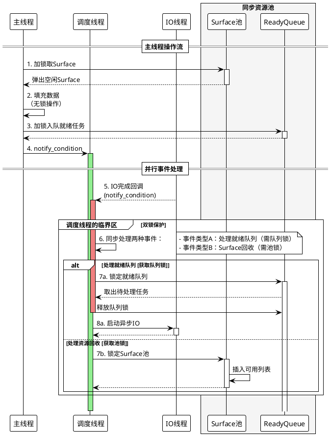

# FastDump: 高性能异步视频帧 Dump 管理

### 项目简介

`FastDump` 是一个基于 C++11 标准库实现的高性能异步视频帧 dump 管理类。它采用多线程、条件变量、future/promise 机制，实现了主线程、调度线程、IO线程的生产-消费-调度异步协作，适用于高吞吐量的视频帧异步写盘场景。

### 设计思路

1. 主线程和 dump 过程异步，不降低主线程任务吞吐量

2. 利用 GPU 显存池，主线程encode 掩盖 surface copy 产生的延迟

3. IO 速度一定是比 GPU surface copy 速度要慢的，服务好 IO ，让 IO 线程满载读写很重要。


### 实现细节

- **C++11 多线程与同步**：仅依赖标准库的 thread、mutex、condition_variable、future。
- **主线程接口极简**：主线程只需生成 surface 并调用 `dump`，无需关心池、同步、调度等细节。
- **Surface 池自动管理**：内部维护 surface 池和ready队列，自动分配与回收。
- **调度与 IO 分离**：专职调度线程处理同步逻辑，与IO 线程的解耦，IO 线程专职批量写盘。
- **多个 IO 策略**：通过 lambda + std::function 实现 IO 策略多态，支持普通文件写和 mmap 写，策略由 config 配置。
- **高效批量写盘**：支持 surface 批量写盘，减少磁盘寻道，提升吞吐

### 调用和伪代码

```cpp
#include "fastdump.h"
#include <thread>
#include <iostream>

int main() {
    FastDump fastdump;

    int width = 1920, height = 1080;
    std::thread main_thread([&fastdump, width, height] {
        while (true) {
            Surface tmp(width, height, -1);
            std::generate(tmp.data.begin(), tmp.data.end(), []{ return rand() % 256; });
            fastdump.dump(tmp);
        }
    });

    std::this_thread::sleep_for(std::chrono::seconds(5));
    main_thread.join();

    std::cout << "FastDump finished." << std::endl;
    return 0;
}
```

线程调用伪代码

```cpp
/ ====== 核心数据结构 ======
struct Surface {
    vector<byte> data;
    int id, width, height;
    bool is_ready, is_written;
};

enum EventType { NEW_SURFACE, IO_COMPLETED, SHUTDOWN };

struct Event {
    EventType type;
    Surface* surface;
};

// ====== FastDump类 ======
class FastDump {
private:
    // 1. Surface池管理
    vector<unique_ptr<Surface>> surfaces;
    vector<int> available_indices;
    mutex pool_mtx;
    condition_variable cv_main;

    // 2. 事件系统
    queue<Event> event_queue;
    mutex event_mtx;
    condition_variable event_cv;
    
    // 3. 异步IO管理
    unordered_map<Surface*, future<void>> pending_io;
    mutex io_mtx;
    
    // 4. 线程和任务
    thread scheduler_thread;
    atomic<bool> stop_flag{false};
    function<void(Surface*)> io_func;

public:
    FastDump(const Config& config) {
        // 初始化Surface池
        for (int i = 0; i < config.surface_count; i++) {
            surfaces.emplace_back(new Surface{...});
            available_indices.push_back(i);
        }
        
        // 设置IO函数
        io_func = [this](Surface* s) { /* 写入文件逻辑 */ };
        
        // 启动调度线程
        scheduler_thread = thread(&FastDump::scheduler_loop, this);
    }
    
    void dump(const Surface& src) {
        // 1. 加锁获取空闲Surface
        int idx;
        {
            lock_guard<mutex> lock(pool_mtx);
            if (available_indices.empty()) {
                // 等待或丢弃
                return;
            }
            idx = available_indices.back();
            available_indices.pop_back();
        }
        
        // 2. 填充数据（无锁）
        Surface* s = surfaces[idx].get();
        s->data = src.data; // 拷贝数据
        s->is_ready = true;
        
        // 3. 加入事件队列
        {
            lock_guard<mutex> lock(event_mtx);
            event_queue.push({NEW_SURFACE, s});
        }
        
        // 4. 通知调度线程
        event_cv.notify_one();
    }
    
private:
    void scheduler_loop() {
        while (!stop_flag) {
            // 1. 等待事件
            Event event;
            {
                unique_lock<mutex> lock(event_mtx);
                event_cv.wait(lock, [this]{ 
                    return !event_queue.empty() || stop_flag; 
                });
                
                if (event_queue.empty()) continue;
                
                event = event_queue.front();
                event_queue.pop();
            }
            
            // 2. 处理不同类型事件
            switch (event.type) {
                case NEW_SURFACE:
                    // 调度新Surface进行IO
                    start_async_io(event.surface);
                    break;
                    
                case IO_COMPLETED:
                    // 回收已处理Surface
                    recycle_surface(event.surface);
                    break;
                    
                case SHUTDOWN:
                    return;
            }
        }
    }
    
    void start_async_io(Surface* s) {
        // 使用packaged_task包装IO操作
        auto task = make_shared<packaged_task<void()>>([this, s]{
            // 执行IO
            io_func(s);
            
            // IO完成后发送事件
            {
                lock_guard<mutex> lock(event_mtx);
                event_queue.push({IO_COMPLETED, s});
            }
            event_cv.notify_one();
        });
        
        // 启动异步任务并跟踪
        {
            lock_guard<mutex> lock(io_mtx);
            pending_io[s] = task->get_future();
        }
        
        // 在线程中执行
        thread([task]{ (*task)(); }).detach();
    }
    
    void recycle_surface(Surface* s) {
        // 标记完成
        s->is_written = true;
        
        // 移除任务记录
        {
            lock_guard<mutex> lock(io_mtx);
            pending_io.erase(s);
        }
        
        // 回收到可用池
        {
            lock_guard<mutex> lock(pool_mtx);
            available_indices.push_back(s->id);
        }
        
        // 通知主线程 cv_main.notify_one();
    }
};
```


## 配置说明

```cpp
struct FastDumpConfig {
    std::string io_type = "file";      // "file" 或 "mmap"
    std::string output_dir = "./dump";
    int surface_count = 50;
    int width = 1920;
    int height = 1080;
    int batch_size = 8;
};
```




