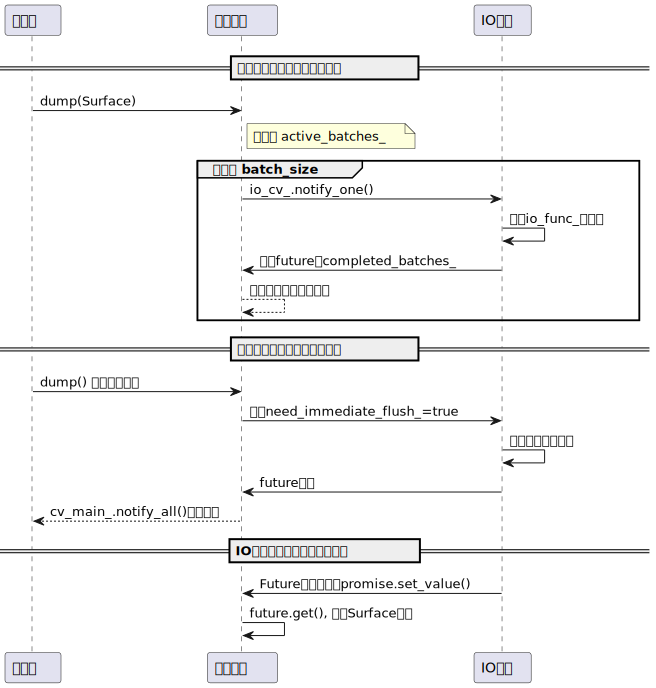

# FastDump: 高性能异步视频帧 Dump 管理

## 项目简介

`FastDump` 是一个基于 C++11 标准库实现的高性能异步视频帧 dump 管理类。它采用多线程、条件变量、future/promise 机制，实现了主线程、调度线程、IO线程的生产-消费-调度异步协作，适用于高吞吐量的视频帧异步写盘场景。

对于4K帧编码一般为 xms 以上，而blitter engine

## 设计思路

IO 速度一定是比 GPU surface copy 速度要慢的，所以线程调度重点

1. 主线程和 dump 过程异步，不降低主线程任务吞吐量

2. 利用 GPU 显存池，主线程encode 掩盖 surface copy 产生的延迟

3. 服务好 IO ，让 IO 线程满载读写很重要。

   

- **C++11 多线程与同步**：仅依赖标准库的 thread、mutex、condition_variable、future。
- **主线程接口极简**：主线程只需生成 surface 并调用 `dump`，无需关心池、同步、调度等细节。
- **Surface 池自动管理**：内部维护 surface 池和可用队列，自动分配与回收。
- **调度与 IO 分离**：专职调度线程处理同步逻辑，与IO 线程的解耦，IO 线程专职批量写盘。
- **多个 IO 策略**：通过 lambda + std::function 实现 IO 策略多态，支持普通文件写和 mmap 写，策略由 config 配置。
- **高效批量写盘**：支持 surface 批量写盘，减少磁盘寻道，提升吞吐。



## 典型用法

```cpp
#include "fastdump.h"
#include <thread>
#include <iostream>

int main() {
    FastDump fastdump;

    int width = 1920, height = 1080;
    std::thread main_thread([&fastdump, width, height] {
        while (true) {
            Surface tmp(width, height, -1);
            std::generate(tmp.data.begin(), tmp.data.end(), []{ return rand() % 256; });
            fastdump.dump(tmp);
        }
    });

    std::this_thread::sleep_for(std::chrono::seconds(5));
    main_thread.join();

    std::cout << "FastDump finished." << std::endl;
    return 0;
}
```

## 配置说明

```cpp
struct FastDumpConfig {
    std::string io_type = "file";      // "file" 或 "mmap"
    std::string output_dir = "./dump";
    int surface_count = 50;
    int width = 1920;
    int height = 1080;
    int batch_size = 8;
};
```


加或者不加相差多少呢
