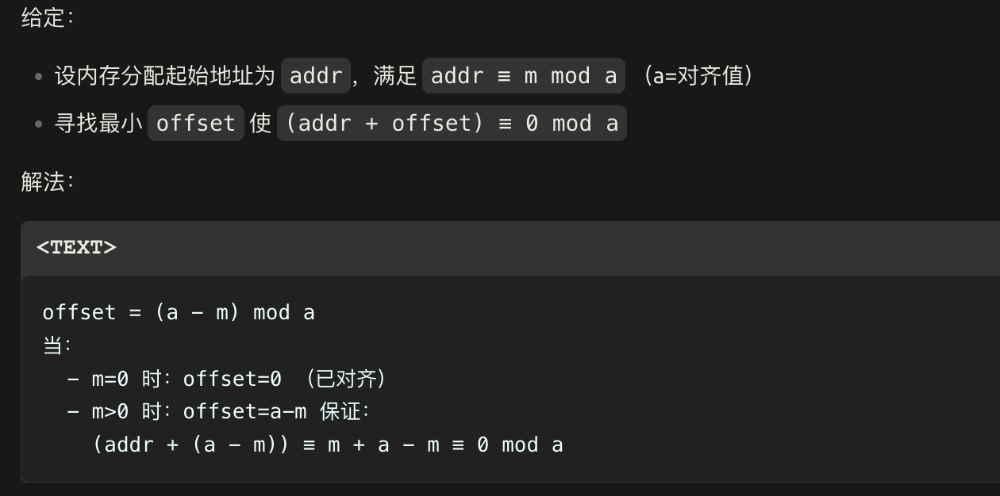
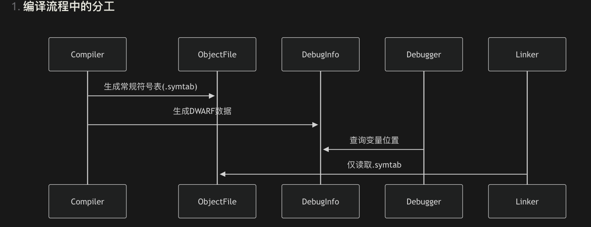

# Interviews

### 多线程

- CPP 当中如何实现多线程，如何创建一个线程?

  ```cpp
  #include <iostream>
  #include <thread>
  void thread_function(int id) {
      std::cout << "Thread " << id << " is running!" << std::endl;
  }
  int main() {
      std::thread t1(thread_function, 1);  // 创建线程并传入参数
      std::thread t2(thread_function, 2);
      t1.join();  // 等待线程 t1 完成
      t2.join();  // 等待线程 t2 完成
      return 0;
  }
  
  //1. lambda 
  // 按值捕获 [x, msg]
      std::thread t([x, msg]() {  // 使用捕获列表
          std::cout << "Thread: x = " << x << ", msg = " << msg << std::endl;
      });
  //2. 使用 bind
      auto lambda = [](int x, const std::string& s) {
          std::cout << "Thread: x = " << x << ", s = " << s << std::endl;
      };
      // 用 bind 提前绑定参数
      auto bound_lambda = std::bind(lambda, 42, "Bound!");
      std::thread t(bound_lambda);
  ```

  

- 介绍一个同步的方式，是怎么实现的？

  锁，条件变量，原子操作，future

  - 锁的演化：手动锁 自动锁 灵活锁

    ```cpp
    //------ 手动锁
    std::mutex mtx;  
    int shared_data = 0;
    void increment() {
        for (int i = 0; i < 100000; ++i) {
            mtx.lock();      // 获取锁
            ++shared_data;   // 临界区
            mtx.unlock();    // 释放锁
        }
    }
    //------ 自动锁
    void safer_increment() {
        for (int i = 0; i < 100000; ++i) {
            std::lock_guard<std::mutex> lock(mtx);  // 构造时加锁，析构时自动解锁
            ++shared_data;
        }
    }
    
    //----灵活锁 可以转移所有权 配合条件变量进行 wait 使用
    void flexible_increment() {
        for (int i = 0; i < 100000; ++i) {
            std::unique_lock<std::mutex> lock(mtx, std::defer_lock); // 延迟加锁
            // 做一些不涉及共享数据的操作...
            lock.lock();  // 手动加锁
            ++shared_data;
            // 锁会在作用域结束时自动释放
        }
    }
    ```

  - 条件变量

    ```cpp
    std::condition_variable cv;
    std::mutex cv_mtx;
    bool ready = false;
    void worker() {
        std::unique_lock<std::mutex> lock(cv_mtx);
        cv.wait(lock, []{ return ready; }); // 等待条件满足
        std::cout << "Worker processed data" << std::endl;
    }
    void producer() {
        std::this_thread::sleep_for(std::chrono::seconds(1));
        {
            std::lock_guard<std::mutex> lock(cv_mtx);
            ready = true;
        }
        cv.notify_one(); // 唤醒等待的线程
    }
    ```

  - 原子操作

    ```cpp
    std::atomic<int> atomic_counter(0);
    void atomic_increment() {
        for (int i = 0; i < 100000; ++i) {
            ++atomic_counter; // 原子操作，无需锁
        }
    }
    ```

  - future

    ```cpp
    int calculate(int x, int y) {
        return x * y;
    }
    int main() {
        auto future_result = std::async(std::launch::async, calculate, 6, 7);
        int result = future_result.get(); // 阻塞等待结果
        std::cout << "Result: " << result << std::endl;
        return 0;
    }
    
    //---task 概念
    //1. 线程执行和任务打包分开
    //2. 可以放入容器当中批量管理
    int main() {
        // 1. 创建 packaged_task，包装可调用对象
        std::packaged_task<int(int, int)> task(calculate);
        
        // 2. 获取关联的 future
        std::future<int> result = task.get_future();
        
        // 3. 将任务转移到线程执行（也可以放入任务队列）
        std::thread t(std::move(task), 6, 7);
        t.detach();  // 通常应该更妥善地管理线程
        
        // 4. 获取结果
        std::cout << "Result: " << result.get() << std::endl;
        
        return 0;
    }
    ```

    

- 创建一个线程怎么做自己的消息队列呢 消息队列没有消息的时候，线程什么状态 如何实现一个阻塞和唤醒

  ```python
  class MessageQueue:
      queue: 线程安全的任务队列
      mutex: 互斥锁
      cond: 条件变量
      running: 布尔标志 (初始为 true)
      
      // 添加任务到队列 (优雅的 RAII 版本)
      function post(task):
          with lock_guard(mutex):  // 自动加锁/解锁
              queue.push(task)
          cond.notify_one()       // 唤醒一个等待线程
      	
      // 工作线程主循环 (更安全的锁管理)
      function run():
          while true:
              task = null
              
              // 使用 unique_lock 以便条件变量操作
              with unique_lock(mutex):  // 自动加锁
                  cond.wait(lock, []{ return !queue.empty() || !running })
                  
                  if !running && queue.empty():
                      return  // 自动解锁
                      
                  task = queue.pop()
                  // unique_lock 自动解锁
              
                  task()  // 在锁外执行任务
      
      // 优雅停止队列
      function stop():
          with lock_guard(mutex):  // 自动加锁/解锁
              running = false
          cond.notify_all()       // 唤醒所有线程
  
  
  # --------------        
  // 创建队列
  mq = new MessageQueue()
  // 启动工作线程
  worker = new Thread(mq.run)
  // 发送任务
  mq.post(() => print("任务1"))
  mq.post(() => print("任务2"))
  // 停止队列
  mq.stop()
  worker.join()
  ```

  

### 存储管理

- 移动构造使用场景是什么

  移动构造（Move Constructor）是 C++11 引入的重要特性，主要解决 **深拷贝性能问题**，核心场景是通过“窃取”临时对象资源来避免不必要的复制

  ```cpp
  std::vector<std::string> vec;
  std::string s = "很长的字符串......";
  vec.push_back(std::move(s)); // 移动而非拷贝
  ```

  - 自动触发情况

    - 类型实现了移动构造，并且构造传入右值，编译器优先调用移动构造 **（临时对象、std::move结果）**

      原对象会置空

      

  - 注意

    - 对含有 **堆内存/文件句柄/网络连接** 的类必须实现移动构造

      ```cpp
      std::unique_ptr<File> openFile() {
          return std::unique_ptr<File>(new File("data.bin"));
      }
      auto file = openFile(); // 移动构造转移文件句柄所有权
      ```

      

- **指针和引用有什么区别呢**

  - 引用必须初始化，绑定后不能修改，而指针可以延迟并换绑，引用是一种语法糖

- **C++当中你最常用的智能指针是什么？在什么场景下使用**

  `unique_ptr`

- **虚函数的实现原理是什么？**

  - 如何实现的多态？

  - 基类和子类都有一个还是共用一个虚函数表

    各自有一个，而子类在基类的副本上进行追加

  -  虚函数表指针存在于对象什么位置 

    对象内存**首部**插入一个` vptr` 地址，比如在 64 位操作系统上就是 8 字节,多继承的时候有多个 `vptr`

  - cpp 内存模型是什么

    

  - 虚函数指针指向的位置是哪里

- functional 和继承的多态有什么不同？ 

  - 性能会降低 15%～25%
  - 实现方式不同，通过类型擦除加 invoke 等

- 如何分配地址 64K对齐的显存块呢？

  过量分配 -> 地址偏移->返回对齐后的指针->通过映射表记录原指针。下面给出验证 `offset=(a-m)mod a`

  

  ```cpp
  //-----------
  #include <cuda_runtime.h>
  void* alignedCudaMalloc(size_t size, size_t alignment) {
      void* basePtr;
      size_t offset;
      size_t totalSize = size + alignment - 1;
      
      cudaMalloc(&basePtr, totalSize);
      
      // 计算对齐后的地址偏移
      offset = (alignment - (size_t)basePtr % alignment) % alignment;
      void* alignedPtr = (char*)basePtr + offset;
      
      // 存储原始指针便于释放（可使用哈希表管理）
      g_ptrMap[alignedPtr] = basePtr;
      
      return alignedPtr;
  }
  void alignedCudaFree(void* alignedPtr) {
      cudaFree(g_ptrMap[alignedPtr]);
      g_ptrMap.erase(alignedPtr);
  }
  //调用 64K 对齐时，64*1024
  void* ptr = alignedCudaMalloc(1024, 65536); // 分配1KB内存，64KB对齐
  
  //-----------简化算法
  //对齐值为2的幂，可以快速求 mod，而判断是否为 2 的幂也有快速办法如下图
  const bool is_power_of_two = (alignment & (alignment - 1)) == 0;
  当且仅当 alignment = 2^n 时，可以通过位与操作优化：
  address % alignment → address & (alignment-1)
  
  //这个是一个完全相等的转化 可以等价于 ceil(numeric_addr // alignment) * alignment
    
  constexpr uintptr_t alignment = 4096;
  uintptr_t aligned_addr = (numeric_addr + alignment - 1) & ~(alignment - 1);
  
  //-----------建议使用uintptr_t类型进行推导
    //在 cpp11 当中最好使用uintptr_t来进行地址计算会更安全
  #include <cstdint>  // 必须包含的头文件
  void* raw_ptr = malloc(1024);
  // 将指针安全转化为整数（C++11+）
  uintptr_t numeric_addr = reinterpret_cast<uintptr_t>(raw_ptr);
  // 对齐计算（4096字节对齐）
  constexpr uintptr_t alignment = 4096;
  uintptr_t aligned_addr = (numeric_addr + alignment - 1) & ~(alignment - 1);
  // 转换回指针
  void* aligned_ptr = reinterpret_cast<void*>(aligned_addr);
  ```
  
  
  
  

​	

### 编译链接

- 如何去做c++库的裁剪 哪些 cpp 符号是可以裁剪的 怎么做裁剪操作

  - 减少二进制体积

    将函数和变量放入 section，`-ffunction-sections`。然后 让链接器分析孤立节点并进行移除`--gc-sections`，也就是对代码段的物理删除。

  - 减少符号表，优化链接时的内存占用，对于多进程共享库重要

    这个符号表是链接符号表，和 debug 符号表不同的。微软闭源PDB，UNIX 的用 DWARF 格式。

    

    


- 使用句柄 fd会遇到什么问题，如果一个句柄被别人关闭了，你再去使用报错什么

  - 当`close(fd)`执行后，内核会将文件描述符从进程的**打开文件表**中移除
  - 后续操作该`fd`时，内核检查到其已失效，直接返回错误。`EBADF` (Bad file descriptor)
  - 若`fd`被意外复用（如新打开的文件恰好分配相同数值的fd），可能导致数据写入错误目标文件

  在 linux 下可以 查看进程持有有效文件句柄

  ```bash
  ls -l /proc/$(pidof your_program)/fd
  ```

  

### 模板

- 什么是可变模板？一般和完美转发一起使用？

  ```cpp
  template <typename... Args>
  void wrapper(Args&&... args) {
      // 完美转发所有参数到目标函数
      target(std::forward<Args>(args)...);  // 关键点：forward + ...展开
  }
  // 使用：wrapper(1, "a"); 会原样转发参数类型
  ```

  

### build

 make 

### reference

