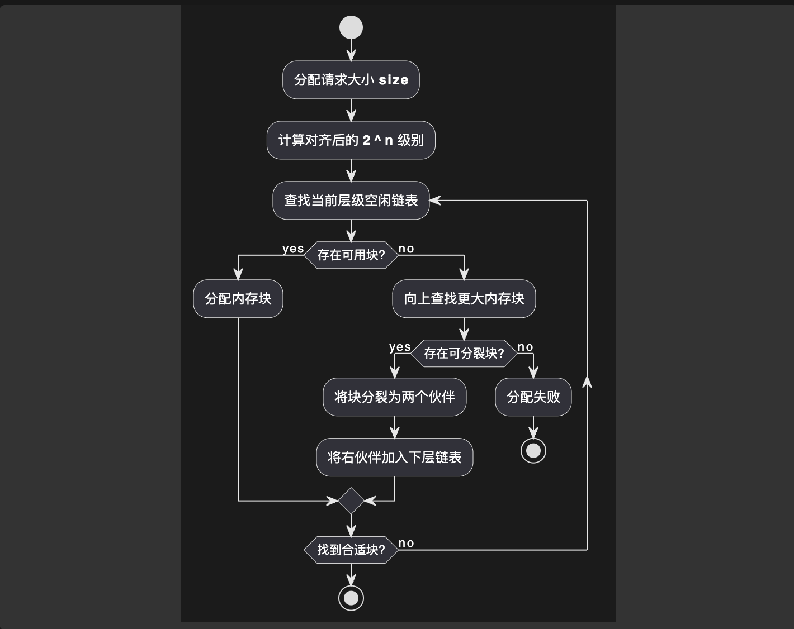
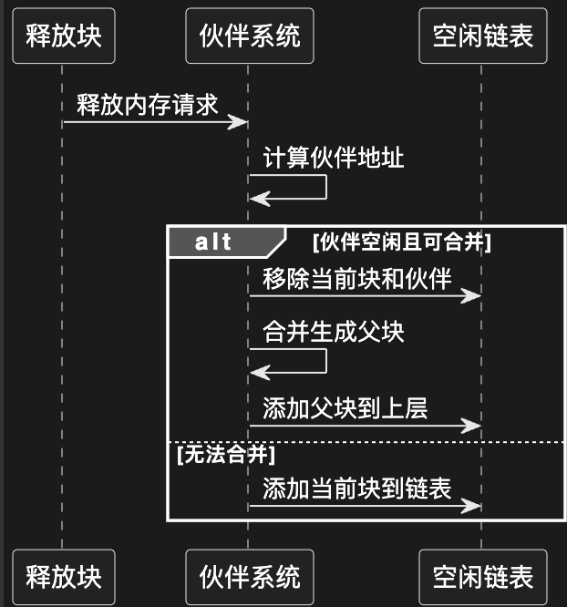

# Buddy_Allocator

### 整体时序图


### 数据结构


```cpp
class MemoryPool:
    MAX_LEVEL: int  # 最大分块层级 2^0 ~ 2^MAX_LEVEL
    min_size: int   # 最小分配单元
    
    # 每个层级的空闲块链表
    free_lists: List[LinkedList] 
    
    # 块头结构（隐式存储）
    struct BlockHeader:
        size: int       # 块的大小级别（2^k）
        is_free: bool
        # 物理位置隐式包含伙伴信息
class LinkedList:
    head: BlockHeader*
```

### 初始化

```cpp
void init_pool(void* heap_start, uint total_size):
    max_level = log2(total_size)
    min_size = 2^0 // 按需求调整
    
    // 初始化空闲链表数组
    free_lists = new LinkedList[max_level + 1]
    
    // 初始整个内存作为一个大块
    BlockHeader* header = heap_start as BlockHeader*
    header.size = max_level
    header.is_free = true
    free_lists[max_level].add(header)
```

### 内存分配



```cpp
function malloc(size_t req_size) -> void*:
    // 字节对齐处理
    aligned_size = round_up_power2(max(req_size + header_size, min_size))
    level = log2(aligned_size)
    
    // 从对应层级开始寻找
    for l in level...MAX_LEVEL:
        if not free_lists[l].empty():
            block = free_lists[l].pop()
            return split_block(block, level)
    
    return null // 内存不足
// 分割内存块逻辑
function split_block(BlockHeader* block, int target_level):
    while block.size > target_level:
        // 创建伙伴块
        buddy = block.address + (1 << (block.size - 1))
        buddy_header = buddy as BlockHeader*
        buddy_header.size = block.size - 1
        buddy_header.is_free = true
        // 当前块降级
        block.size -= 1
        
        // 将伙伴加入下级链表
        free_lists[block.size].add(buddy_header)
    
    block.is_free = false
    return block.data_pointer()
```

### 释放



```cpp
function free(void* ptr):
    BlockHeader* header = ptr - sizeof(BlockHeader)
    header.is_free = true
    
    // 向上合并伙伴
    current = header
    while True:
        buddy = calculate_buddy(current)
        
        if not buddy.is_free or buddy.size != current.size:
            break
            
        // 合并到上级
        parent = min(current, buddy)
        parent.size += 1
        free_lists[current.size].remove(current)
        free_lists[buddy.size].remove(buddy)
        current = parent
        
    free_lists[current.size].add(current)
```

